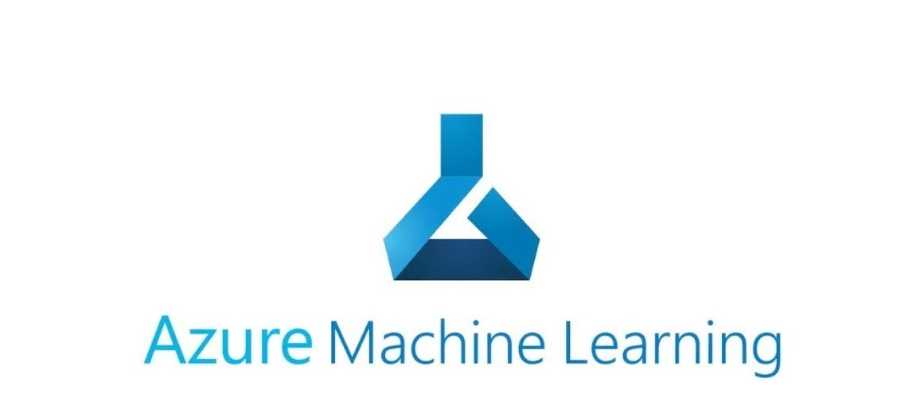
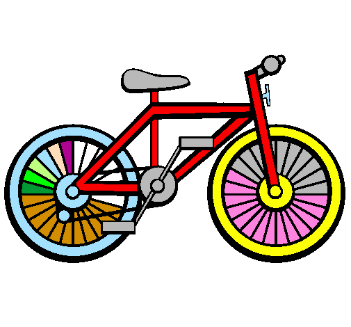
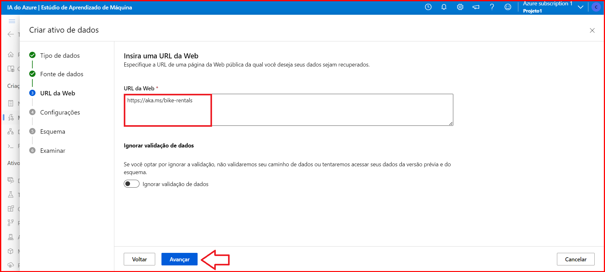
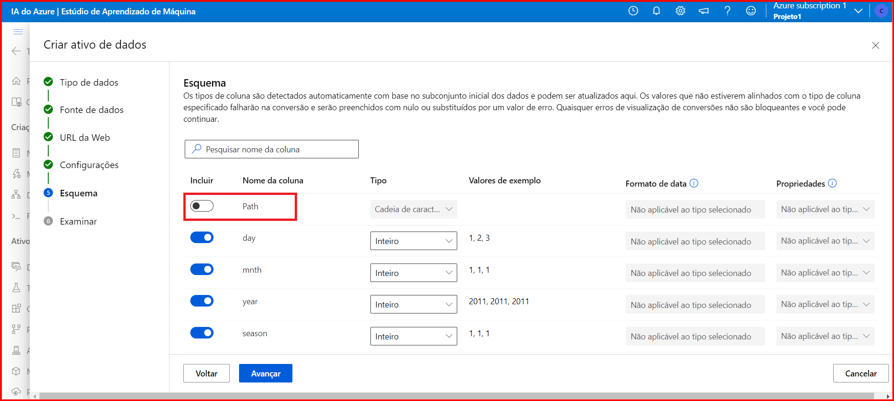
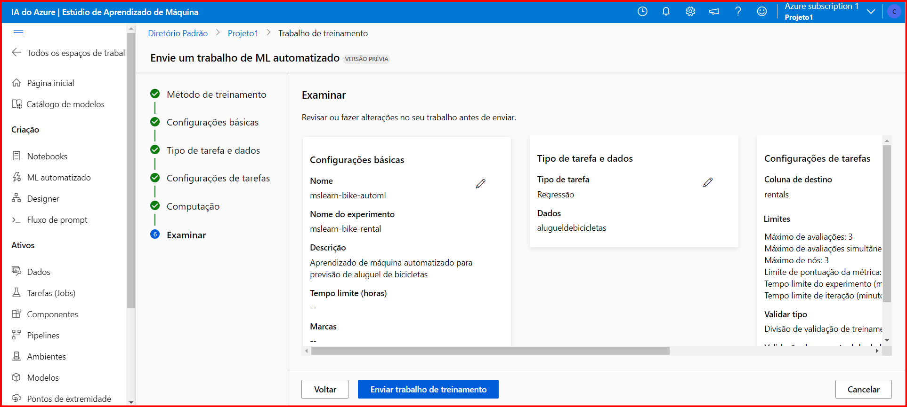
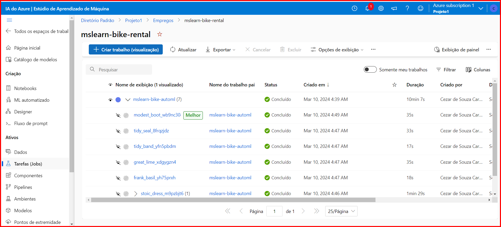
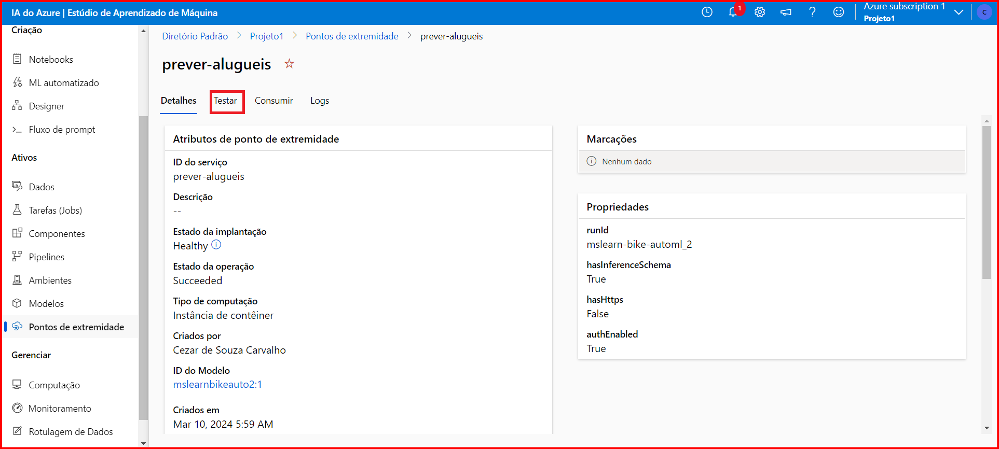

# Passo a passo de um modelo de previsão e a configuração de seus pontos de extremidade:


Primeiramente você deve criar o seu espaço de trabalho (Workspace), através do [portal do Azure](https://www.portal.azure.com).

Caso, já possua um Workspace criado poderá utilizá-lo e acessar o [Launch Studio](https://ml.azure.com) 

## 💡Certifique-se de estar em seu Workspace correto

Os Passos a seguir nos permitirão criar um Modelo de Previsão com seus devidos pontos de extremidade configurados. (❁´◡`❁)

Criaremos o Aprendizado de Máquina (Machine Learning) para a previsão do aluguel de bicicletas.    



# Criação de um trabalho de ML Automatizado:

No Launch Studio, nas diversas opções ao lado esquerdo selecionar  "ML AUTOMATIZADO" 


Clique em "+ Novo trabalho de ML Automatizado"

Clique em Avançar

## O tipo da tarefa será Regressão (Para prever valores numéricos contínuos)

Clique em Avançar para criar o tipo de dados


As fontes serão fornecidas da WEB



Selecione "alugueldebicicletas" para continuar a enviar o ML Automatizado


Expanda as Configurações Adicionais


Expanda a Sessão Limites


Envie o trabalho de treinamento

A Execução demorará alguns minutos para a compilação dos dados

Ao finalizar teremos a informação de Status concluído

...
Pipeline com as etapas do processo e os testes realizados

# Implementação do Modelo

# Teste do Modelo

Ao lado esquerdo clique em Pontos de Extremidade, prever-alugueis, Testar


...

## Para o teste foi utilizado o json abaixo:
```yaml
 {
   "Inputs": { 
     "data": [
       {
         "day": 1,
         "mnth": 1,   
         "year": 2022,
         "season": 2,
         "holiday": 0,
         "weekday": 1,
         "workingday": 1,
         "weathersit": 2, 
         "temp": 0.3, 
         "atemp": 0.3,
         "hum": 0.3,
         "windspeed": 0.3 
       }
     ]    
   },   
   "GlobalParameters": 1.0
 }
 ``````


# O Resultado foi o discriminado abaixo


 


